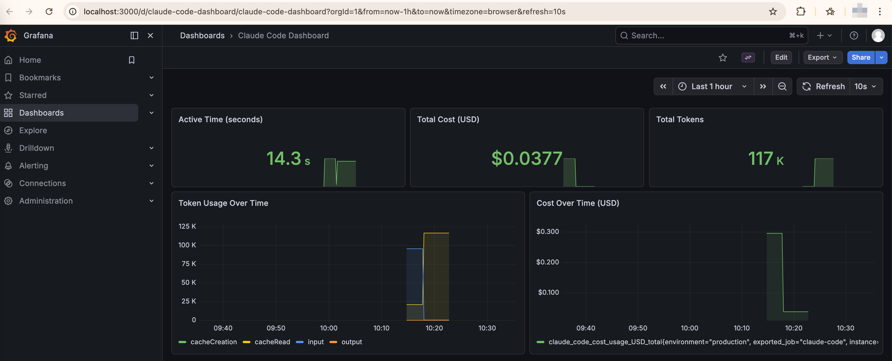

# 🚀 OpenTelemetry 监控 Claude Code - 完整部署历程

> 从零开始的完整部署指南，包含所有踩坑经验、问题解决方案和最佳实践


## 📖 项目背景

本项目是在本地 Docker 环境中部署 OpenTelemetry 监控栈的**完整实践记录**，用于实时监控 Claude Code 的使用情况、成本和性能指标。

### 为什么需要这个项目？

在使用 Claude Code 的过程中，我们经常会有以下疑问：
- 💰 **这个月我在 Claude Code 上花了多少钱？**
- 🔢 **我总共使用了多少 tokens？**
- 📊 **我的使用趋势是什么？**
- 🛠️ **我最常用哪些工具？**
- ⚡ **Claude Code 的性能如何？**

Claude Code 官方提供了 OpenTelemetry 支持，但是**部署过程并非一帆风顺**。本项目记录了从零开始的完整部署过程，包括遇到的所有问题、解决方案和经验总结。

### 📊 监控效果展示

部署完成后，您可以在 Grafana 中看到实时更新的监控数据：



**Dashboard 包含以下面板**：
- ✅ **Active Time (seconds)** - 显示总活跃时间
- ✅ **Total Cost (USD)** - 累计成本统计
- ✅ **Total Tokens** - Token 使用总数
- ✅ **Token Usage Over Time** - Token 使用趋势图
- ✅ **Cost Over Time** - 成本变化趋势图

所有数据每 10 秒自动刷新，实时反映您的 Claude Code 使用情况。

## ✨ 功能特性

- 💰 **成本追踪** - 实时监控 API 使用成本
- 🔢 **Token 统计** - 输入/输出/缓存 token 使用情况
- ⏱️ **活跃时间** - 跟踪实际使用时间
- 📊 **实时仪表板** - Grafana 可视化展示
- 🐳 **一键部署** - Docker Compose 容器化部署
- 📚 **完整文档** - 详细的部署、排查和优化指南

## 🏗️ 架构

```
Claude Code (环境变量配置)
    ↓ OTLP (gRPC:4317, HTTP:4318)
OTEL Collector (接收和处理)
    ↓ Prometheus Exporter (:8889)
Prometheus (存储和查询)
    ↓
Grafana (可视化展示)
```

### 技术栈

| 组件 | 版本 | 端口 | 用途 |
|------|------|------|------|
| **OrbStack** | 2.0.5 | - | Docker 运行时（轻量级） |
| **OTEL Collector** | contrib:0.147.0 | 4317, 4318, 8889 | 接收和处理遥测数据 |
| **Prometheus** | 3.10.0 | 9090 | 时序数据库 |
| **Grafana** | latest | 3000 | 可视化仪表板 |
| **Jaeger** | all-in-one | 16686 | 分布式追踪（可选） |


## 🚀 快速开始

### 前置要求

- macOS 系统
- OrbStack 或 Docker Desktop
- Claude Code CLI 已安装
- Homebrew（用于安装工具）

### 5 分钟快速部署

```bash
# 1. 进入项目目录
cd ~/otel-docker

# 2. 启动监控栈
docker-compose up -d

# 3. 验证服务状态
docker-compose ps

# 4. 配置 Claude Code（在新终端中）
source ~/otel-docker/test-claude-env.sh
claude

# 5. 访问监控界面
open http://localhost:3000  # Grafana
```

### 访问地址

| 服务 | URL | 凭据 |
|------|-----|------|
| **Grafana** | http://localhost:3000 | admin/admin |
| **Prometheus** | http://localhost:9090 | - |
| **Jaeger** | http://localhost:16686 | - |
| **Dashboard** | http://localhost:3000/d/claude-code-dashboard/ | - |

## 📊 成功收集的指标

### 当前可用的指标

| 指标名称 | 描述 | 单位 |
|---------|------|------|
| `claude_code_active_time_seconds_total` | 活跃时间总计 | 秒 |
| `claude_code_cost_usage_USD_total` | 成本总计 | 美元 |
| `claude_code_token_usage_tokens_total` | Token 使用总数 | tokens |

### Dashboard 面板

1. **Active Time (seconds)** - 显示总活跃时间
2. **Total Cost (USD)** - 显示累计成本
3. **Total Tokens** - 显示 Token 使用总数
4. **Token Usage Over Time** - Token 使用趋势图
5. **Cost Over Time** - 成本趋势图

所有面板每 10 秒自动刷新。

## 🛠️ 工具和脚本

### 诊断工具

```bash
# 完整诊断
./diagnose-full.sh

# 快速检查
./check-metrics.sh

# 实时监控
./monitor.sh
```

### 环境变量配置

```bash
# 临时配置（推荐）
source ~/otel-docker/test-claude-env.sh

# 永久配置（添加到 ~/.zshrc）
export CLAUDE_CODE_ENABLE_TELEMETRY=1
export OTEL_METRICS_EXPORTER=otlp
export OTEL_LOGS_EXPORTER=otlp
export OTEL_EXPORTER_OTLP_PROTOCOL=grpc
export OTEL_EXPORTER_OTLP_ENDPOINT=http://localhost:4317
```

## 📚 完整文档索引

### 核心文档

| 文档 | 说明 |
|------|------|
| **[README.md](./README.md)** | 本文档 - 项目概览和快速开始 |
| **[DEPLOYMENT_SUMMARY.md](./DEPLOYMENT_SUMMARY.md)** | 完整部署总结 |
| **[DEPLOYMENT_GUIDE.md](./DEPLOYMENT_GUIDE.md)** | 详细部署指南（博客风格） |
| **[TROUBLESHOOTING.md](./TROUBLESHOOTING.md)** | 故障排查完整指南 |
| **[PROJECT_STRUCTURE.md](./PROJECT_STRUCTURE.md)** | 项目结构说明 |

### 使用指南

| 文档 | 说明 |
|------|------|
| **[CREATE_MANUAL_DASHBOARD.md](./CREATE_MANUAL_DASHBOARD.md)** | 手动创建 Grafana 面板 |
| **[VIEW_DATA_IN_GRAFANA.md](./VIEW_DATA_IN_GRAFANA.md)** | 在 Grafana 中查看数据 |
| **[DASHBOARD_FIX.md](./DASHBOARD_FIX.md)** | Dashboard 修复说明 |
| **[QUICKSTART.md](./QUICKSTART.md)** | 快速开始指南 |


## 🌟 项目亮点

1. **完整的部署历程** - 从零到成功的完整记录
2. **详细的故障排查** - 每个问题都有解决方案
3. **实用的工具脚本** - 简化日常操作
4. **完善的文档体系** - 覆盖所有使用场景
5. **实际可用** - 真正解决了监控需求

## 🚀 下一步计划

- [ ] 添加更多 Grafana 面板
- [ ] 配置告警规则
- [ ] 添加成本预算告警
- [ ] 优化查询性能
- [ ] 添加更多维度分析

## 🔗 相关资源

- [Claude Code 监控文档](https://code.claude.com/docs/zh-CN/monitoring-usage)
- [OpenTelemetry 官方文档](https://opentelemetry.io/docs/)
- [Prometheus 查询语言](https://prometheus.io/docs/prometheus/latest/querying/basics/)
- [Grafana 官方文档](https://grafana.com/docs/)
- [OrbStack 官网](https://orbstack.dev/)

## 📄 许可证

MIT License

## 🤝 贡献

欢迎提交 Issue 和 Pull Request！

## 💬 反馈

如有问题或建议，请：
1. 查看完整文档：[DEPLOYMENT_GUIDE.md](./DEPLOYMENT_GUIDE.md)
2. 运行诊断脚本：`./diagnose-full.sh`
3. 提交 GitHub Issue

---

## 🎉 总结

这个项目不仅是监控工具的部署记录，更是一次完整的**学习和实践过程**。

### 我们学到了什么？

1. **OpenTelemetry 的实际应用**
   - 如何配置和部署
   - 常见问题和解决方案

2. **监控系统的架构设计**
   - 数据流的配置
   - 组件间的协作

3. **问题排查的方法论**
   - 系统化的诊断流程
   - 逐步验证的重要性

4. **文档和知识管理**
   - 完整记录部署过程
   - 创建可复用的指南

### 适用场景

这个项目适合：
- ✅ 想要监控 Claude Code 使用的开发者
- ✅ 学习 OpenTelemetry 的初学者
- ✅ 需要部署监控栈的运维人员
- ✅ 研究可观测性的技术团队

**享受监控的乐趣！** 🎉

如有问题，请查看完整文档或提交 Issue。
